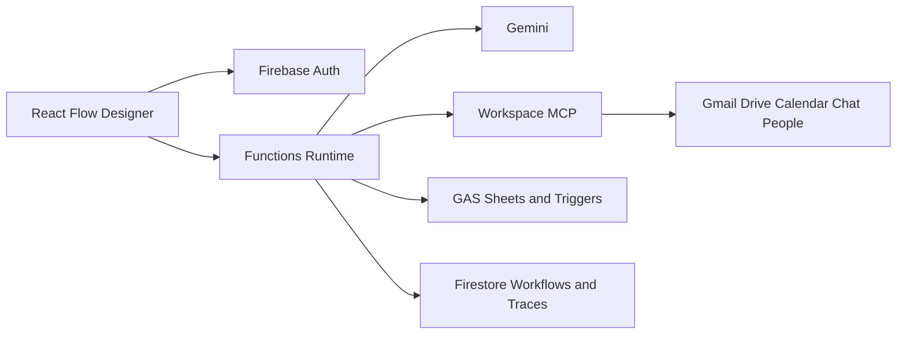

# G8N 2.0 Architecture

The web application designs and observes workflows. The runtime owns credentials, policy enforcement and execution. `WorkflowEngine` accepts registered executors, follows explicit edges, pauses on approval and resumes from the persisted trace. Tool providers normalize MCP and extension tools into one contract.

## Trust boundary

Workspace documents and messages are untrusted model input. They cannot alter workflow policy, allowed tools, system instructions or approval requirements. Production implementations should sanitize displayed content and keep OAuth refresh tokens encrypted at rest.

## Versioning

Workflow definitions have an integer version. Templates use semantic versions. Runs permanently reference both workflow ID and version so published evaluation results remain reproducible.
